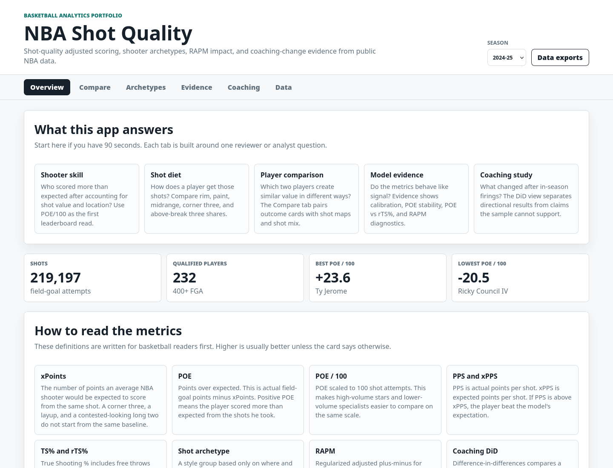
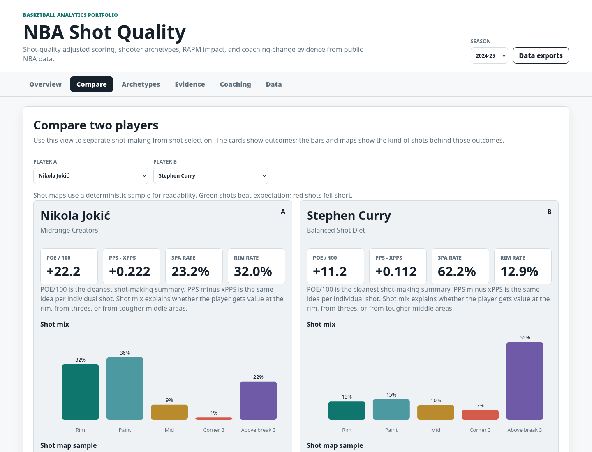
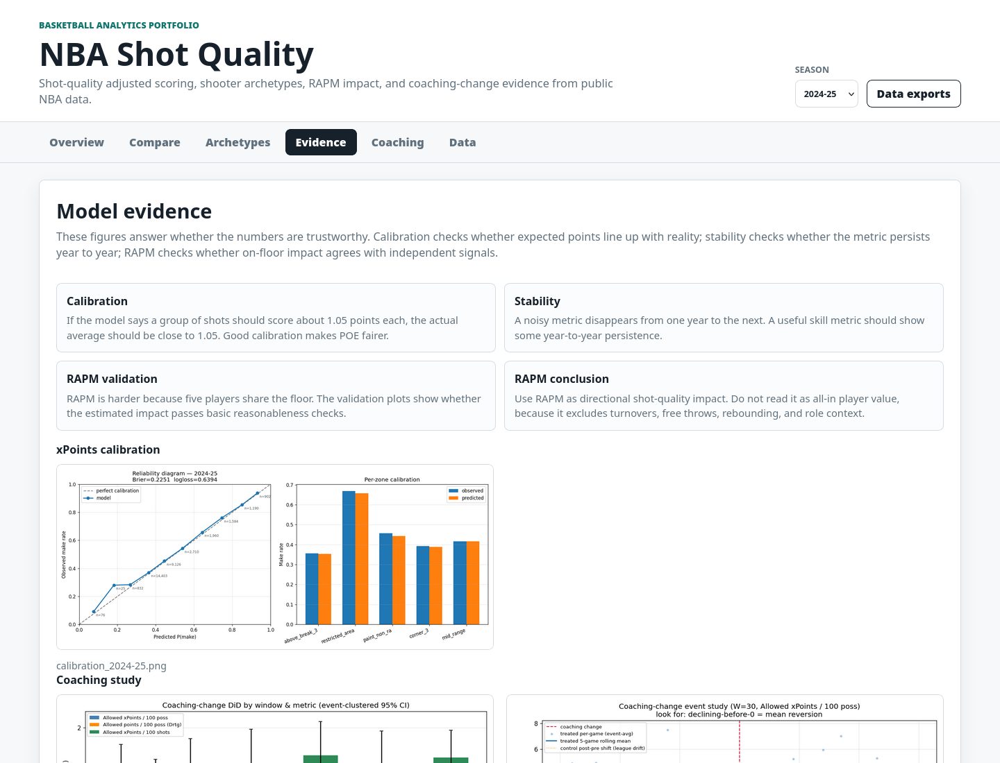

# NBA Shot Quality

NBA Shot Quality is a hybrid data science and basketball analytics portfolio project. It estimates
the expected points of every NBA field-goal attempt, turns those predictions into player-level
shot-making skill, and layers on a browser dashboard for scouting-style comparison.

The dashboard is designed for basketball readers: every view includes plain-English definitions for
the core metrics, what the chart is comparing, and how to interpret positive or negative values.

**Live app:** [NBA Shot Quality on GitHub Pages](https://jahankazimi078.github.io/nba-shot-quality/)

**Hiring brief:** [docs/portfolio_brief.md](docs/portfolio_brief.md)

## Start Here

For a 90-second review:

1. Open the [live app](https://jahankazimi078.github.io/nba-shot-quality/) and stay on `Overview`.
2. Scan `What this app answers`, then note that POE/100 adjusts shot-making for expected shot value.
3. Open `Compare` and put a star next to a specialist to see how shot diet changes the interpretation.
4. Open `Evidence` and check calibration, POE stability, POE vs rTS%, and RAPM diagnostics.
5. Open `Coaching` for the uncertainty-aware DiD read: directional defensive improvement, not a
   causal victory lap.
6. Open `Data` if you want the CSV package behind each dashboard view.

## What It Shows

- **xPoints model:** LightGBM make-probability model converted to expected points per shot.
- **POE shooter skill:** player-season points over expected with bootstrap confidence intervals.
- **Player profiles and archetypes:** shot-zone shares, 3PA rate, rim rate, average distance, POE,
  TS%, and rTS%, with deterministic KMeans shot-diet archetypes.
- **RAPM impact:** ridge on/off shot-quality model for offensive, defensive, and net shot impact.
- **Coaching DiD study:** mid-season coaching changes analyzed with calendar-aligned
  difference-in-differences windows.

## Headline Findings

- POE behaves like a repeatable skill: the 2023-24 to 2024-25 qualified-player correlation is
  **r = 0.58**.
- POE and relative TS% agree but are not redundant: 2024-25 POE vs rTS% correlation is **r = 0.66**,
  leaving useful differences where shot difficulty matters.
- 2024-25 leaders by POE/100 include Ty Jerome (**+23.6**), Nikola Jokic (**+22.2**), and Payton
  Pritchard (**+21.1**) among players with at least 200 attempts.
- The coaching-change study finds directionally better actual defensive rating after firings, but
  event-clustered intervals span zero. The honest read is "uncertain and sample-limited," not a
  causal victory lap.

## App

Public app: <https://jahankazimi078.github.io/nba-shot-quality/>

Local preview:

```bash
make setup
make app-artifacts
make app
```

Then open `http://localhost:8000`.

The app has six tabs:

- `Overview`: season-level summary, key findings, and top POE players.
- `Compare`: side-by-side player metrics, shot mix bars, POE/rTS comparison, and shot maps.
- `Archetypes`: shot-diet clusters, archetype leaderboard, and top/bottom POE within each group.
- `Evidence`: calibration, POE stability, RAPM validation plots, and RAPM leaderboards.
- `Coaching`: DiD summary, event-study plot, and per-event estimates.
- `Data`: direct CSV links for every export.

## Dashboard Screenshots







## Method

1. Ingest regular-season shot detail from public NBA endpoints.
2. Engineer shot context: distance, angle, zone, action type, period, clock, and shot value.
3. Train a LightGBM classifier to predict make probability, grouped by game for validation.
4. Convert make probability to xPoints, then score out-of-fold shots to avoid in-sample inflation.
5. Aggregate POE to player seasons with bootstrap intervals and external TS%/rTS% references.
6. Build player profiles from shot diet only, then cluster those profiles with deterministic KMeans.
7. Fit RAPM on shot-quality outcomes and run validation plots against POE, stability, and tracking.
8. Analyze coaching changes with event-window DiD and event-clustered bootstrap intervals.

See [docs/case_study.md](docs/case_study.md) for the methodology narrative and limitations, and
[docs/data_dictionary.md](docs/data_dictionary.md) for metric definitions and exported-column
documentation.

## Reproduce The Pipeline

```bash
python3 -m venv .venv
.venv/bin/pip install -e ".[dev]"
```

Run xPoints for one season:

```bash
.venv/bin/python -m nba_shot_quality.cli ingest   --season 2024-25
.venv/bin/python -m nba_shot_quality.cli features --season 2024-25
.venv/bin/python -m nba_shot_quality.cli train    --season 2024-25
.venv/bin/python -m nba_shot_quality.cli eval     --season 2024-25
```

Run the shooter-skill pipeline:

```bash
.venv/bin/python -m nba_shot_quality.cli ingest-stats --season 2024-25
.venv/bin/python -m nba_shot_quality.cli score        --season 2024-25
.venv/bin/python -m nba_shot_quality.cli poe          --season 2024-25
.venv/bin/python -m nba_shot_quality.cli stability    --season-a 2023-24 --season-b 2024-25
.venv/bin/python -m nba_shot_quality.cli poe-vs-rts   --season 2024-25
```

Run reusable scripts:

```bash
bash scripts/run_xpoints.sh 2024-25
bash scripts/run_poe.sh 2024-25 2023-24
bash scripts/run_rapm.sh
.venv/bin/python -m nba_shot_quality.cli coaching-study
```

Build deploy artifacts:

```bash
.venv/bin/python -m nba_shot_quality.cli app-artifacts --seasons 2022-23 2023-24 2024-25
```

The generated CSV package includes complete per-season shot exports, player profiles, leaderboards,
RAPM ratings, coaching-study tables, model-evidence image index, and smaller deterministic shot-map
samples for browser rendering.

Full `shots_YYYY-YY.csv` exports are intentionally large audit files. The browser dashboard uses
`shot_map_sample_YYYY-YY.csv` files for shot maps so player comparison remains responsive.

## Deploy

GitHub Pages deploys the `static/` directory from `main` with
[.github/workflows/pages.yml](.github/workflows/pages.yml). To validate a local deploy package:

```bash
make test
node --check static/app.js
python3 -m http.server 8000 -d static
```

## Validation

```bash
make test
```

`make test` runs Ruff and pytest. The test suite covers shot-zone derivation, POE aggregation math,
player-profile generation, archetype determinism, coaching DiD helper calculations, and committed
CSV schema smoke checks.

## Project Structure

- `src/nba_shot_quality/ingest/`: public NBA data ingestion and caching.
- `src/nba_shot_quality/features/`: shot and lineup feature builders.
- `src/nba_shot_quality/models/`: xPoints, POE, RAPM, and app artifact logic.
- `src/nba_shot_quality/eval/`: calibration, POE stability, and RAPM diagnostics.
- `src/nba_shot_quality/analysis/`: coaching-change DiD study.
- Dashboard assets: app shell, CSV exports, and bundled report images.
- `docs/`: case study, data dictionary, and portfolio hiring brief.

## Limitations

- The xPoints model uses public shot detail, not tracking features such as closest defender,
  catch-and-shoot status, or touch time.
- POE is field-goal only; TS% and rTS% include free throws and are shown as external references.
- RAPM is shot-quality impact, not total player value.
- The coaching study has only seven in-season firing events in the cached seasons, so uncertainty is
  large and causal claims should stay modest.

## Resume Bullets

- Built an end-to-end NBA xPoints pipeline with grouped validation, out-of-fold scoring, and an
  interactive scouting dashboard backed by public-data CSV exports.
- Designed POE, a shot-quality-adjusted shooter metric with bootstrap intervals and year-over-year
  stability validation across three NBA seasons.
- Added player archetype clustering, RAPM impact diagnostics, and a coaching-change DiD case study
  to show modeling, metric design, dashboarding, and causal-analysis judgment.
