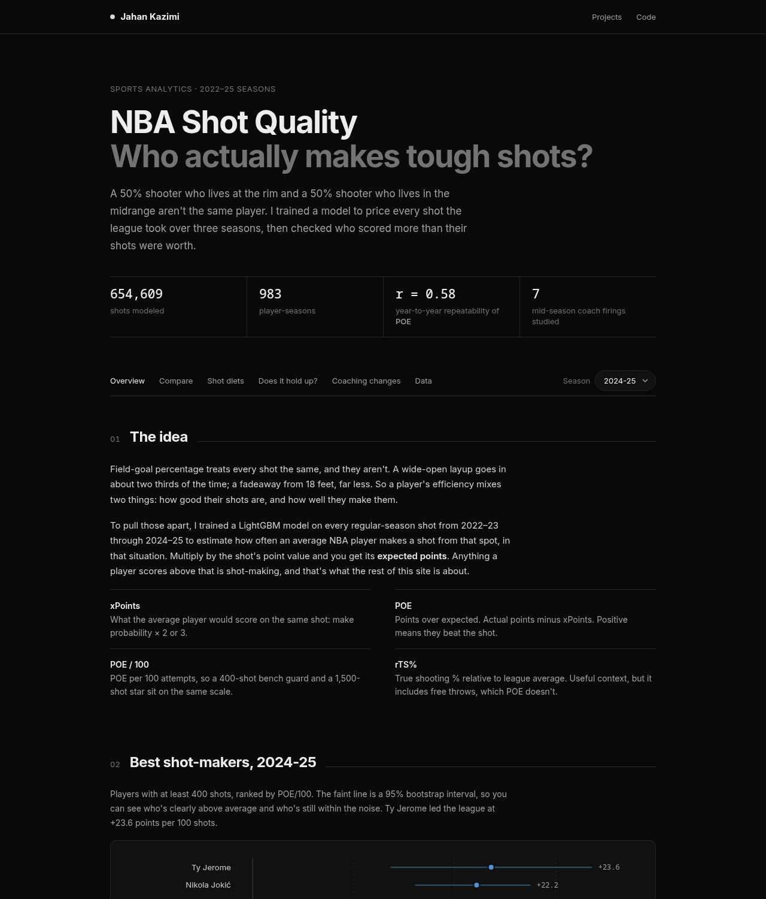

# NBA Shot Quality

**[Open the site →](https://jahankazimi078.github.io/nba-shot-quality/)**

Field-goal percentage treats every shot the same, and they aren't. A wide-open layup and a contested
fadeaway both count as one attempt, so a player's efficiency ends up mixing two things: how good their
shots are, and how well they make them.

This project pulls those apart. I trained a model on every NBA regular-season shot from 2022–23 through
2024–25 (654,609 of them) to estimate how many points an average player would score from each one. Whatever
a player scores above that is shot-making, which I call **points over expected (POE)**.

From there I kept pulling on the thread:

- **Is it real?** POE per 100 shots has a 0.58 correlation from one season to the next, so it's mostly
  skill rather than a hot streak.
- **What kind of shooter is this?** Players are grouped by *where* they shoot from, so you can compare a
  spacer to other spacers instead of to centers.
- **Does it depend on teammates?** I rebuilt every lineup from play-by-play data and fit a RAPM model to
  estimate each player's effect on shot quality at both ends.
- **Does firing the coach help the defense?** A difference-in-differences study of the 7 mid-season firings
  in those three seasons.



## What I found

- **Shot-making repeats.** POE/100 correlates at r = 0.58 year to year among qualified players. It also
  tracks relative true shooting (r = 0.66) without duplicating it, and the gaps between the two are where
  shot difficulty matters.
- **The 2024–25 leaders** (200+ attempts) were Ty Jerome (+23.6 per 100 shots), Nikola Jokić (+22.2), and
  Payton Pritchard (+21.1).
- **Offensive RAPM agrees with POE** (r ≈ 0.7) even though it comes from a separate lineup model. Defensive
  RAPM is much noisier (r ≈ 0.12 year to year). It only sees shot attempts and has to split credit five ways,
  so I pool it across all three seasons and treat it as rough. The top of the list is still the rim
  protectors you'd expect.
- **Firing the coach:** points allowed fell about 2.5 per 100 possessions relative to other teams, but the
  quality of shots allowed barely moved, and with only 7 events every interval crosses zero. I'd call it a
  lean, not a result.

## How it works

1. Pull shot-level data from the public NBA stats API and cache it as Parquet.
2. Build shot features: distance, angle, zone, action type, period, game clock, and shot value.
3. Train a LightGBM make/miss classifier with folds grouped by game, so shots from one game never appear in
   both training and validation. Expected points = make probability × shot value. Held-out Brier score is
   0.225 (a constant guess gets 0.248), and every shot zone is calibrated within about 1.5 percentage points.
4. Score every shot out of fold, so a player's own hot night never leaks into their baseline.
5. Sum up to player-seasons, with 1,000-sample bootstrap intervals.
6. Cluster players into shot diets with k-means, using location features only (never performance).
7. Rebuild on-court lineups from play-by-play substitutions and fit ridge RAPM. About 96% of shots
   reconstruct to a clean 5-on-5, and those match the NBA's own rotation data 99% of the time.
8. Run the coaching study as calendar-aligned difference-in-differences with bootstrap intervals clustered
   by event.

The longer write-up is in [docs/case_study.md](docs/case_study.md), and every column is defined in
[docs/data_dictionary.md](docs/data_dictionary.md).

## Running it

```bash
make setup            # venv + editable install
make app-artifacts    # rebuild the CSVs the site reads
make app              # serve static/ at http://localhost:8000
make test             # ruff + pytest
```

Each pipeline stage is its own CLI command, so you can re-run one without the rest:

```bash
# expected-points model
.venv/bin/python -m nba_shot_quality.cli ingest   --season 2024-25
.venv/bin/python -m nba_shot_quality.cli features --season 2024-25
.venv/bin/python -m nba_shot_quality.cli train    --season 2024-25
.venv/bin/python -m nba_shot_quality.cli eval     --season 2024-25

# shooter skill (POE)
.venv/bin/python -m nba_shot_quality.cli ingest-stats --season 2024-25
.venv/bin/python -m nba_shot_quality.cli score        --season 2024-25
.venv/bin/python -m nba_shot_quality.cli poe          --season 2024-25
.venv/bin/python -m nba_shot_quality.cli stability    --season-a 2023-24 --season-b 2024-25

# or chain them
bash scripts/run_xpoints.sh 2024-25
bash scripts/run_poe.sh 2024-25 2023-24
bash scripts/run_rapm.sh 2022-23 2023-24 2024-25
.venv/bin/python -m nba_shot_quality.cli coaching-study
```

The NBA API rate-limits hard, so ingest commands cache everything and skip anything already downloaded.
Pass `--force` to re-pull.

The site itself is plain HTML, CSS, and JavaScript in `static/`, deployed to GitHub Pages on every push to
`main`.

## Layout

- `src/nba_shot_quality/ingest/`: data pulls and caching
- `src/nba_shot_quality/features/`: shot features and lineup reconstruction
- `src/nba_shot_quality/models/`: xPoints, POE, and RAPM
- `src/nba_shot_quality/eval/`: calibration, stability, and RAPM checks
- `src/nba_shot_quality/analysis/`: the coaching study
- `static/`: the website and its CSV data
- `docs/`: write-up and data dictionary

## Limitations

- Public shot data has no tracking info (closest defender, touch time, catch-and-shoot), so the model can't
  tell an open three from a contested one at the same spot.
- POE covers field goals only. Free throws show up in TS% but not here.
- RAPM measures effect on shot quality, not total value. Turnovers, rebounds, and fouls aren't in it.
- Seven coaching changes is a small sample. The design is sound, but the answer is still uncertain.
